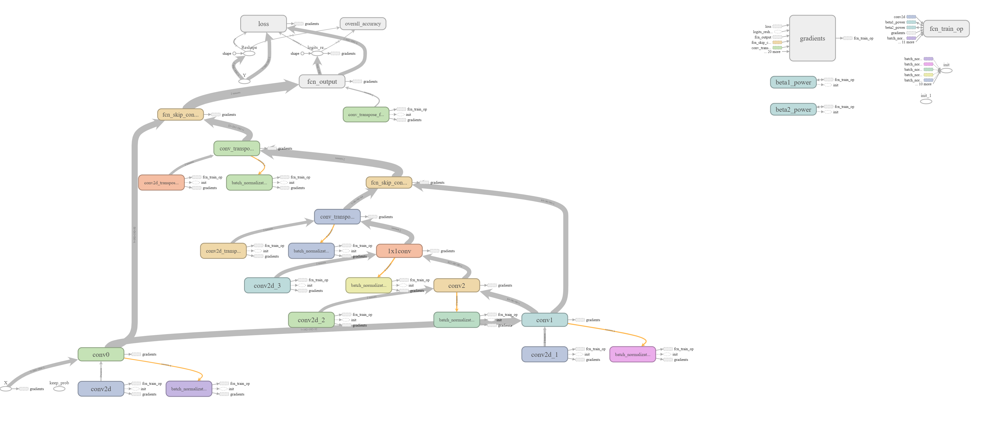

# Kaggle SIIM-ACR Pneumothorax Segmentation

This repository is an attempt to develop an FCN (Fully Convolutional Network) which can classify (and if present, segment) pneumothorax from a set of chest radiographic images. Assuming that you have signed up at [Kaggle](https://www.kaggle.com/), you need to participate in [SIIM-ACR Pneumothorax Segmentation](https://www.kaggle.com/c/siim-acr-pneumothorax-segmentation) competition and download the dataset as per the instructions stated on the competition page.

Once downloaded, you will see two new folders in your directory viz. `dicom-images-test` and `dicom-images-train` and a `train-rle.csv` file.

### What should I expect the data format to be?
The data is comprised of images in DICOM format and annotations in the form of image IDs and run-length-encoded (RLE) masks. Some of the images contain instances of pneumothorax (collapsed lung), which are indicated by encoded binary masks in the annotations. Some training images have multiple annotations.
```
1.2.276.0.7230010.3.1.4.8323329.14508.1517875252.443873,387620 23 996 33 986 43 977 51 968 58 962 65 956 70 952 74 949 76 946 79
```

Images without pneumothorax have a mask value of -1.
```
1.2.276.0.7230010.3.1.4.8323329.1034.1517875166.8504,-1
```

### What am I predicting?
We are attempting to 
1. predict the existence of pneumothorax in our test images and 
2. indicate the location and extent of the condition using masks. Our model should create binary masks and encode them using RLE. Note that we are using a relative form of RLE (meaning that pixel locations are measured from the end of the previous run) as indicated below:

1.2.276.0.7230010.3.1.4.8323329.14508.1517875252.443873,387620 23 996 33 986 43 977 51 968 58 962 65 956 70 952 74 949 76 946 79

Sample code is available for download that may help with encoding and decoding this form of RLE. Each test image may only have one mask submitted for it. It should combine all predicted masks for that image.

### Preprocessing
After downloading the dataset, you need to first preprocess it before feeding it to training. To do so, we are using Python's [h5py](https://www.h5py.org/) library and [pydicom](https://pydicom.github.io/pydicom/stable/getting_started.html) library for processing the DICOM files. 

The DICOM files are read by `pydicom`, converted to a `Numpy` array, resized to 384x384 and then divided by 255. This normalizes the image. The image is resized because the original dimension of the image is 1024x1024 which causes memory overflow on my GPU while training. Once normalized, the image is added to a H5 dataset. The scripts creates multiple datasets where each dataset holds 512 images. The datasets are labelled as `images_<dataset_number>` and `ann_<dataset_number>`. 

To start the preprocessing of images, run,
```
python preprocess.py
```

### Architecture
Once all images are preprocessed and stored to disk, you are ready to train your model. But before training, let's review the network architecture.
The network consists of 3 convolution layers, followed by 1x1 convolution layer and 2 transpose convolution layers followed by output layer. A single convolution layers performs the following operations,
1. Convolution with a convolution stride of 2, padding set to "SAME" and "relu" as the activation function.
2. If `is_batch_norm` flag is True then it performs batch normalization as well.
3. If `is_dropout` flag is True then it adds a dropout with the specified probability.

The 1x1 convolution performs the exact same operation but the only difference is that the filter numbers are exactly the same as the convolution layer before 1x1 and the convolution stride is set to 1.

A single transpose convolution performs the following operations,
1. Transpose convolution with a convolution stride of 2, padding set to "SAME" and "relu" as the activation function.
2. If `is_batch_norm` flag is True then it performs batch normalization as well.
3. If `is_dropout` flag is True then it adds a dropout with the specified probability.

The output layer performs only a transpose convolution operation with 1 filter, padding set to "SAME" and "sigmoid" as activation.



### Training
To train the model, simply run,
```
python run.py -f tf
```
Notice the argument `-f`. This argument specifies the frameowrk to be used for training. At this point, only *TensorFlow* is supported for training. *MxNet* will be added soon. This script will create the network and train it. Once training is completed, it will save the model in `tf_model` directory. It also creates a `tf_logs` directory which holds all `tensorboard` related files.